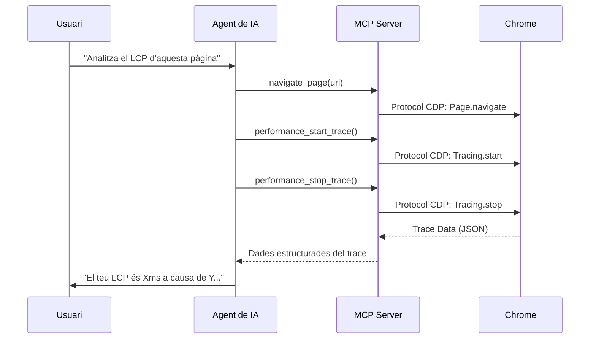

# Conceptes Clau: MCP i SKILLs

Abans d'aprofundir en l'anàlisi, és fonamental entendre les dues tecnologies que estem combinant en aquest workshop.

## 1. Què és el Model Context Protocol (MCP)?

El **Model Context Protocol (MCP)** és un estàndard obert que permet als models de IA (com Gemini, Claude o Codex) connectar-se de forma segura amb fonts de dades i eines externes. En el nostre cas, el MCP actua com un "driver" que dona a l'agent accés directe a les APIs internes de Chrome DevTools.

- **Per a què serveix:** Permet a l'agent navegar per webs, gravar traces de performance, analitzar la xarxa i capturar captures de pantalla de forma autònoma.
- **Documentació oficial:** [Model Context Protocol (MCP)](https://modelcontextprotocol.io/)

## 2. Què són les Agent Skills?

Les **Agent Skills** són conjunts de coneixements i capacitats predefinides que se li atorguen a un agent de IA. A diferència del MCP (que és la "connexió"), les SKILLs són el "saber fer". Inclouen snippets de codi, fluxos de treball (workflows) i arbres de decisió que guien l'agent per a resoldre problemes específics.

- **Per a què serveix:** Permeten a l'agent saber quins snippets de JavaScript executar si el LCP és lent, com interpretar un waterfall de xarxa o quins suggeriments donar per a optimitzar una imatge.
- **Documentació oficial:** [Agent Skills](https://agentskills.io/)

---

# Anatomia del MCP: Com interactua l'Agent amb Chrome?

El Model Context Protocol (MCP) funciona com un pont estandarditzat entre el teu agent de IA i les eines internes de Chrome DevTools.

## De Eines a Capacitats del LLM

Quan instal·les el servidor de Chrome DevTools MCP, estàs exposant més de 25 eines directament a l'agent. Algunes de les més interessants per a Web Performance són:

| Eina                      | Acció en Chrome DevTools                                       |
| :------------------------ | :------------------------------------------------------------- |
| `performance_start_trace` | Inicia una gravació al panell "Performance".                   |
| `performance_stop_trace`  | Atura la gravació i processa les dades del trace.              |
| `network_list_requests`   | Llista totes les peticions al panell "Network".                |
| `network_get_request`     | Inspecciona capçaleres, temps i resposta d'una petició.        |
| `dom_take_snapshot`       | Captura l'estat actual del DOM i de l'arbre d'accessibilitat.  |
| `lighthouse_audit`        | Executa auditories d'accessibilitat, SEO i millors pràctiques. |

## Com funciona el flux de treball?

## Avantatges sobre Lighthouse

A diferència de Lighthouse, que ofereix un snapshot estàtic, el MCP permet a l'agent:

- **Interactuar**: Fer scroll, click o omplir formularis mentre grava el trace de performance.
- **Context profund**: Llegir el codi font real del projecte per a relacionar un problema de performance amb una línia de codi específica.
- **Debugging selectiu**: Analitzar un waterfall de xarxa per a detectar problemes específics de CORS o priorització de recursos (`fetchpriority`).
