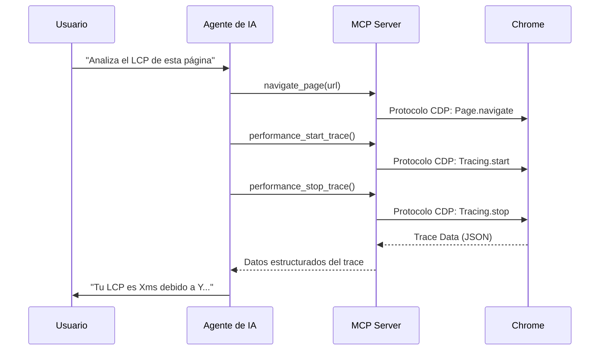

# Conceptos Clave: MCP y SKILLs

Antes de profundizar en el análisis, es fundamental entender las dos tecnologías que estamos combinando en este workshop.

## 1. ¿Qué es el Model Context Protocol (MCP)?

El **Model Context Protocol (MCP)** es un estándar abierto que permite a los modelos de IA (como Gemini, Claude o Codex) conectarse de forma segura con fuentes de datos y herramientas externas. En nuestro caso, el MCP actúa como un "driver" que da al agente acceso directo a las APIs internas de Chrome DevTools.

- **Para qué sirve:** Permite al agente navegar por webs, grabar traces de performance, analizar la red y capturar pantallazos de forma autónoma.
- **Documentación oficial:** [Model Context Protocol (MCP)](https://modelcontextprotocol.io/)

## 2. ¿Qué son las Agent Skills?

Las **Agent Skills** son conjuntos de conocimientos y capacidades predefinidas que se le otorgan a un agente de IA. A diferencia del MCP (que es la "conexión"), las SKILLs son el "saber hacer". Incluyen snippets de código, flujos de trabajo (workflows) y árboles de decisión que guían al agente para resolver problemas específicos.

- **Para qué sirve:** Permiten al agente saber qué snippets de JavaScript ejecutar si el LCP es lento, cómo interpretar un waterfall de red o qué sugerencias dar para optimizar una imagen.
- **Documentación oficial:** [Agent Skills](https://agentskills.io/)

---

# Anatomía del MCP: ¿Cómo interactúa el Agente con Chrome?

El Model Context Protocol (MCP) funciona como un puente estandarizado entre tu agente de IA y las herramientas internas de Chrome DevTools.

## De Herramientas a Capacidades del LLM

Cuando instalas el servidor de Chrome DevTools MCP, estás exponiendo más de 25 herramientas directamente al agente. Algunas de las más interesantes para Web Performance son:

| Herramienta               | Acción en Chrome DevTools                                      |
| :------------------------ | :------------------------------------------------------------- |
| `performance_start_trace` | Inicia una grabación en el panel "Performance".                |
| `performance_stop_trace`  | Detiene la grabación y procesa los datos del trace.            |
| `network_list_requests`   | Lista todas las peticiones en el panel "Network".              |
| `network_get_request`     | Inspecciona cabeceras, tiempos y respuesta de una petición.    |
| `dom_take_snapshot`       | Captura el estado actual del DOM y del árbol de accesibilidad. |
| `lighthouse_audit`        | Ejecuta auditorías de accesibilidad, SEO y mejores prácticas.  |

## ¿Cómo funciona el flujo de trabajo?

## Ventajas sobre Lighthouse

A diferencia de Lighthouse, que ofrece un snapshot estático, el MCP permite al agente:

- **Interactuar**: Hacer scroll, click o rellenar formularios mientras graba el trace de performance.
- **Contexto profundo**: Leer el código fuente real del proyecto para relacionar un problema de performance con una línea de código específica.
- **Debugging selectivo**: Analizar un waterfall de red para detectar problemas específicos de CORS o priorización de recursos (`fetchpriority`).
