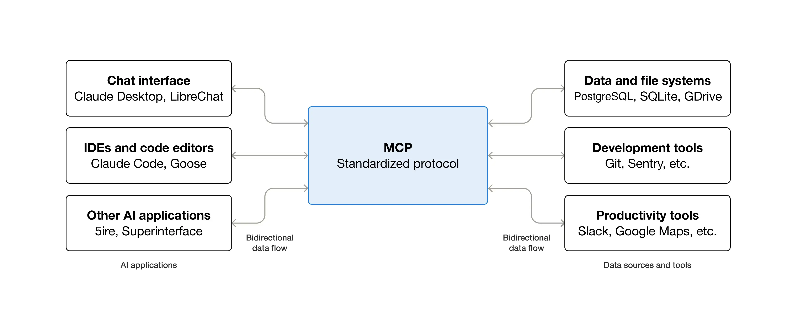
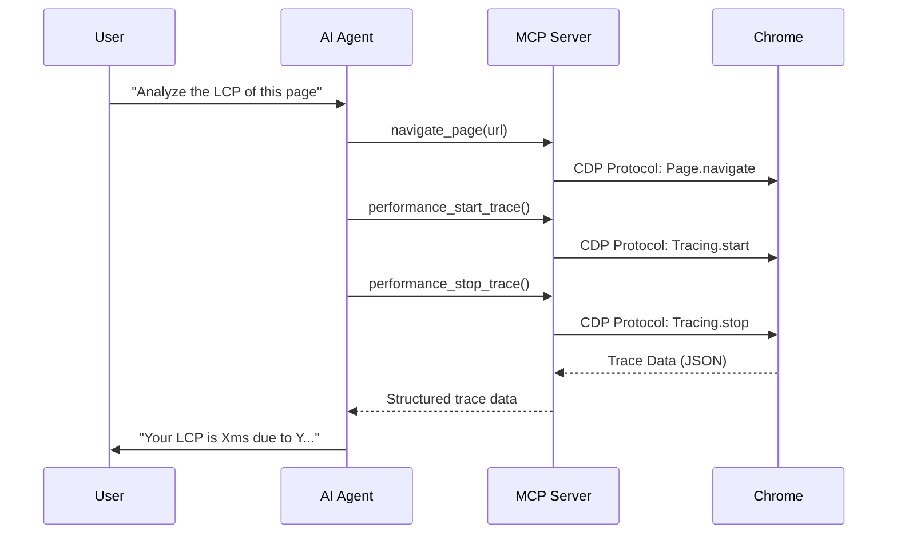

# Key Concepts: MCP and SKILLs

Before diving into the analysis, it's essential to understand the two technologies we're combining in this workshop.

## 1. What is the Model Context Protocol (MCP)?

The **Model Context Protocol (MCP)** is an open standard that allows AI models (like Gemini, Claude, or Codex) to securely connect with external data sources and tools. In our case, the MCP acts as a "driver" that gives the agent direct access to the internal APIs of Chrome DevTools.

- **What it's for:** It allows the agent to navigate websites, record performance traces, analyze the network, and capture screenshots autonomously.
- **Official documentation:** [Model Context Protocol (MCP)](https://modelcontextprotocol.io/)

## 2. What are Agent Skills?

**Agent Skills** are sets of predefined knowledge and capabilities granted to an AI agent. Unlike the MCP (which is the "connection"), SKILLs are the "know-how." They include code snippets, workflows, and decision trees that guide the agent to solve specific problems.

- **What it's for:** They allow the agent to know which JavaScript snippets to run if LCP is slow, how to interpret a network waterfall, or what suggestions to give for optimizing an image.
- **Official documentation:** [Agent Skills](https://agentskills.io/)

---

# Anatomy of the MCP: How the Agent Interacts with Chrome

The Model Context Protocol (MCP) works as a standardized bridge between your AI agent and Chrome DevTools' internal tools.

## From Tools to LLM Capabilities

When you install the Chrome DevTools MCP server, you are exposing more than 25 tools directly to the agent. Some of the most interesting ones for Web Performance are:

| Tool                      | Action in Chrome DevTools                                     |
| :------------------------ | :------------------------------------------------------------ |
| `performance_start_trace` | Starts a recording in the "Performance" panel.                |
| `performance_stop_trace`  | Stops the recording and processes the trace data.             |
| `network_list_requests`   | Lists all requests in the "Network" panel.                    |
| `network_get_request`     | Inspects headers, timing, and response of a request.          |
| `dom_take_snapshot`       | Captures the current state of the DOM and accessibility tree. |
| `lighthouse_audit`        | Runs audits for accessibility, SEO, and best practices.       |

## How Does the Workflow Work?

## Advantages over Lighthouse

Unlike Lighthouse, which offers a static snapshot, MCP allows the agent to:

- **Interact**: Scroll, click, or fill out forms while recording the performance trace.
- **Deep Context**: Read the project's actual source code to relate a performance issue to a specific line of code.
- **Selective Debugging**: Analyze a network waterfall to detect specific CORS issues or resource prioritization (`fetchpriority`).
