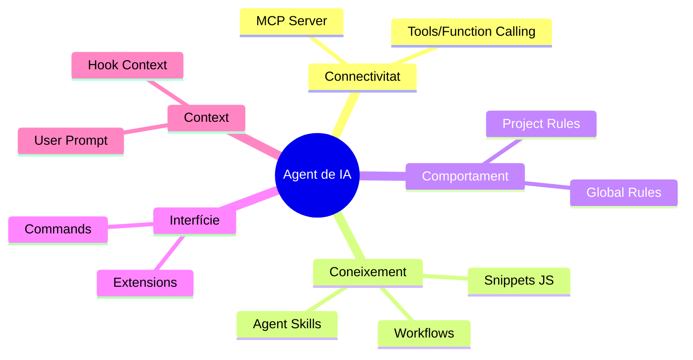

# Referència Ràpida: Conceptes d'Ecosistema de IA

En el món dels Agents de IA i el desenvolupament assistit, sovint es confonen diversos termes. Aquesta guia serveix com a referència ràpida per al workshop.

## Glossari de Conceptes

### 1. Model Context Protocol (MCP)

És la **capa de transport** o connexió. Defineix com una IA pot parlar amb una eina externa (com Chrome, una base de dades o el sistema de fitxers).

- **Enfocament:** Connectivitat i seguretat.
- **Link Oficial:** [modelcontextprotocol.io](https://modelcontextprotocol.io/)

### 2. Agent Skills

És el **coneixement expert** o "saber fer". Són paquets que contenen codi (scripts), instruccions de flux de treball i lògica de decisió per a resoldre problemes específics.

- **Enfocament:** Capacitats i lògica de negoci.
- **Link Oficial:** [agentskills.io](https://agentskills.io/)

### 3. Rules (Project / Global Rules)

Són **instruccions de comportament** i estil. Arxius com `GEMINI.md`, `.cursorrules` o `.claude/rules` que dicten com ha de respondre l'agent, quins estàndards de codi seguir o què evitar.

- **Enfocament:** Guies d'estil, normes de seguretat i context local.

### 4. Agents (Custom / Sub-agents)

Són les **entitats executores**. Un agent és la IA configurada amb accés a eines i regles per a realitzar tasques. Els "Sub-agents" són agents especialitzats als quals l'agent principal delega feina (ex. un agent expert en testing).

- **Enfocament:** Execució de tasques i autonomia.

### 5. Plugins / Extensions

Sovint s'utilitzen de forma intercanviable amb "MCP Servers". Són complements que afegeixen capacitats específiques a una plataforma (com Gemini CLI o Cursor).

- **Enfocament:** Extensibilitat de la plataforma.
- **Link Oficial (Gemini Extensions):** [Gemini Extensions Docs](https://github.com/google-gemini/gemini-cli?tab=readme-ov-file#tools--extensions)

### 6. Commands

Són les **instruccions directes** que l'usuari dóna a la CLI o a l'Agent (ex. `/help`, `/plugin`, `/mcp`). Són accions predefinides que no requereixen raonament de IA per a executar-se.

- **Enfocament:** Control directe i utilitats.

### 7. Tools / Function Calling

Són les **capacitats atòmiques** que el LLM pot invocar. Un MCP Server exposa "Tools" (eines) com `evaluate_script` o `take_screenshot`.

- **Enfocament:** Capacitats d'acció del model.

### 8. Hooks

Són **fonts de context automàtic**. Permeten injectar informació externa (com l'estat d'un servidor, logs d'errors o dades de mètriques en temps real) directament a la finestra de context de la IA sense intervenció de l'usuari.

- **Enfocament:** Enriquiment automàtic del context.

## Jerarquia de l'Ecosistema

---

## Taula Comparativa Ampliada

| Concepte     | Què és?                 | Exemple Real            |
| :----------- | :---------------------- | :---------------------- |
| **MCP**      | El "cable" de connexió  | `chrome-devtools-mcp`   |
| **Skills**   | El "títol expert"       | `webperf-snippets`      |
| **Rules**    | El "manual de conducta" | `GEMINI.md`             |
| **Agents**   | El "treballador"        | Gemini CLI / Sub-agent  |
| **Hooks**    | "Dades automàtiques"    | Context de mètriques    |
| **Plugins**  | L'"accessori"           | `gemini-extensions`     |
| **Commands** | L'"ordre directa"       | `/help`, `/mcp add`     |
| **Tools**    | El "tornavís"           | `evaluate_script`       |

---

## Com interactuen en aquest Workshop?

1.  Usem el **MCP** perquè Gemini pugui "veure" i "utilitzar" Chrome DevTools.
2.  Instal·lem les **Skills** de `webperf-snippets` perquè Gemini sàpiga _què buscar_ i _com analitzar_ el rendiment web.
3.  Podríem definir **Rules** perquè Gemini sempre ens reporti el LCP en un format de taula específic.
4.  L'**Agent** (Gemini) orquestrarà tot l'anterior per a donar-nos la solució.
