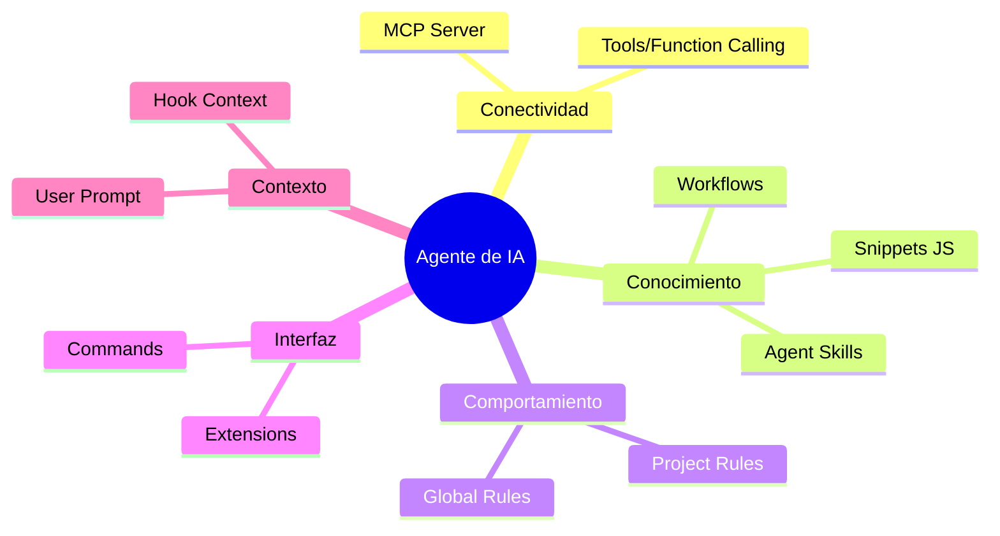

# Referencia Rápida: Conceptos de Ecosistema de IA

En el mundo de los Agentes de IA y el desarrollo asistido, a menudo se confunden varios términos. Esta guía sirve como referencia rápida para el workshop.

## Glosario de Conceptos

### 1. Model Context Protocol (MCP)

Es la **capa de transporte** o conexión. Define cómo una IA puede hablar con una herramienta externa (como Chrome, una base de datos o el sistema de archivos).

- **Enfoque:** Conectividad y seguridad.
- **Link Oficial:** [modelcontextprotocol.io](https://modelcontextprotocol.io/)

### 2. Agent Skills

Es el **conocimiento experto** o "saber hacer". Son paquetes que contienen código (scripts), instrucciones de flujo de trabajo y lógica de decisión para resolver problemas específicos.

- **Enfoque:** Capacidades y lógica de negocio.
- **Link Oficial:** [agentskills.io](https://agentskills.io/)

### 3. Rules (Project / Global Rules)

Son **instrucciones de comportamiento** y estilo. Archivos como `GEMINI.md`, `.cursorrules` o `.claude/rules` que dictan cómo debe responder el agente, qué estándares de código seguir o qué evitar.

- **Enfoque:** Guías de estilo, normas de seguridad y contexto local.

### 4. Agents (Custom / Sub-agents)

Son las **entidades ejecutoras**. Un agente es la IA configurada con acceso a herramientas y reglas para realizar tareas. Los "Sub-agentes" son agentes especializados a los que el agente principal delega trabajo (ej. un agente experto en testing).

- **Enfoque:** Ejecución de tareas y autonomía.

### 5. Plugins / Extensions

A menudo se usan de forma intercambiable con "MCP Servers". Son complementos que añaden capacidades específicas a una plataforma (como Gemini CLI o Cursor).

- **Enfoque:** Extensibilidad de la plataforma.
- **Link Oficial (Gemini Extensions):** [Gemini Extensions Docs](https://github.com/google-gemini/gemini-cli?tab=readme-ov-file#tools--extensions)

### 6. Commands

Son las **instrucciones directas** que el usuario da a la CLI o al Agente (ej. `/help`, `/plugin`, `/mcp`). Son acciones predefinidas que no requieren razonamiento de IA para ejecutarse.

- **Enfoque:** Control directo y utilidades.

### 7. Tools / Function Calling

Son las **capacidades atómicas** que el LLM puede invocar. Un MCP Server expone "Tools" (herramientas) como `evaluate_script` o `take_screenshot`.

- **Enfoque:** Capacidades de acción del modelo.

### 8. Hooks

Son **fuentes de contexto automático**. Permiten inyectar información externa (como el estado de un servidor, logs de errores o datos de métricas en tiempo real) directamente en la ventana de contexto de la IA sin intervención del usuario.

- **Enfoque:** Enriquecimiento automático del contexto.

## Jerarquía del Ecosistema

---

## Tabla Comparativa Ampliada

| Concepto     | ¿Qué es?                | Ejemplo Real            |
| :----------- | :---------------------- | :---------------------- |
| **MCP**      | El "cable" de conexión  | `chrome-devtools-mcp`   |
| **Skills**   | El "título experto"     | `webperf-snippets`      |
| **Rules**    | El "manual de conducta" | `GEMINI.md`             |
| **Agents**   | El "trabajador"         | Gemini CLI / Sub-agente |
| **Hooks**    | "Datos automáticos"     | Contexto de métricas    |
| **Plugins**  | El "accesorio"          | `gemini-extensions`     |
| **Commands** | La "orden directa"      | `/help`, `/mcp add`     |
| **Tools**    | El "destornillador"     | `evaluate_script`       |

---

## ¿Cómo interactúan en este Workshop?

1.  Usamos el **MCP** para que Gemini pueda "ver" y "utilizar" Chrome DevTools.
2.  Instalamos las **Skills** de `webperf-snippets` para que Gemini sepa _qué buscar_ y _cómo analizar_ el rendimiento web.
3.  Podríamos definir **Rules** para que Gemini siempre nos reporte el LCP en un formato de tabla específico.
4.  El **Agente** (Gemini) orquestará todo lo anterior para darnos la solución.
