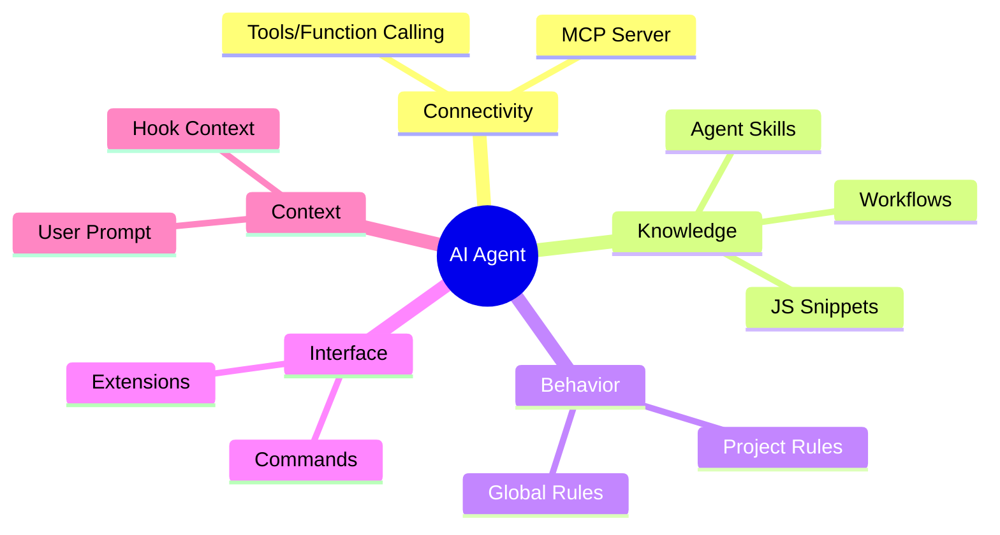

# Quick Reference: AI Ecosystem Concepts

In the world of AI Agents and assisted development, several terms are often confused. This guide serves as a quick reference for the workshop.

## Glossary of Concepts

### 1. Model Context Protocol (MCP)

It is the **transport layer** or connection. It defines how an AI can talk to an external tool (like Chrome, a database, or the file system).

- **Focus:** Connectivity and security.
- **Official Link:** [modelcontextprotocol.io](https://modelcontextprotocol.io/)

### 2. Agent Skills

It is the **expert knowledge** or "know-how." These are packages containing code (scripts), workflow instructions, and decision logic to solve specific problems.

- **Focus:** Capabilities and business logic.
- **Official Link:** [agentskills.io](https://agentskills.io/)

### 3. Rules (Project / Global Rules)

These are **behavioral and style instructions**. Files like `GEMINI.md`, `.cursorrules`, or `.claude/rules` that dictate how the agent should respond, what code standards to follow, or what to avoid.

- **Focus:** Style guides, security standards, and local context.

### 4. Agents (Custom / Sub-agents)

These are the **executing entities**. An agent is the AI configured with access to tools and rules to perform tasks. "Sub-agents" are specialized agents to which the main agent delegates work (e.g., a testing expert agent).

- **Focus:** Task execution and autonomy.

### 5. Plugins / Extensions

They are often used interchangeably with "MCP Servers." These are add-ons that add specific capabilities to a platform (like Gemini CLI or Cursor).

- **Focus:** Platform extensibility.
- **Official Link (Gemini Extensions):** [Gemini Extensions Docs](https://github.com/google-gemini/gemini-cli?tab=readme-ov-file#tools--extensions)

### 6. Commands

These are the **direct instructions** that the user gives to the CLI or the Agent (e.g., `/help`, `/plugin`, `/mcp`). These are predefined actions that do not require AI reasoning to execute.

- **Focus:** Direct control and utilities.

### 7. Tools / Function Calling

These are the **atomic capabilities** that the LLM can invoke. An MCP Server exposes "Tools" like `evaluate_script` or `take_screenshot`.

- **Focus:** Model action capabilities.

### 8. Hooks

These are **automatic context sources**. They allow injecting external information (like server state, error logs, or real-time metrics data) directly into the AI's context window without user intervention.

- **Focus:** Automatic context enrichment.

## Ecosystem Hierarchy

---

## Expanded Comparison Table

| Concept      | What is it?             | Real Example            |
| :----------- | :---------------------- | :---------------------- |
| **MCP**      | The connection "cable"  | `chrome-devtools-mcp`   |
| **Skills**   | The "expert degree"     | `webperf-snippets`      |
| **Rules**    | The "conduct manual"    | `GEMINI.md`             |
| **Agents**   | The "worker"            | Gemini CLI / Sub-agent  |
| **Hooks**    | "Automatic data"        | Metrics context         |
| **Plugins**  | The "accessory"         | `gemini-extensions`     |
| **Commands** | The "direct order"      | `/help`, `/mcp add`     |
| **Tools**    | The "screwdriver"       | `evaluate_script`       |

---

## How Do They Interact in This Workshop?

1.  We use **MCP** so Gemini can "see" and "use" Chrome DevTools.
2.  We install the `webperf-snippets` **Skills** so Gemini knows _what to look for_ and _how to analyze_ web performance.
3.  We could define **Rules** so Gemini always reports the LCP in a specific table format.
4.  The **Agent** (Gemini) will orchestrate all of the above to give us the solution.
