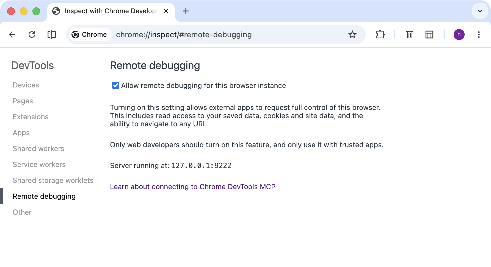

# Guía de Instalación y Configuración

Para utilizar el **Chrome DevTools MCP** con tu agente de IA, sigue los pasos a continuación.

## 1. Requisitos de Software

- **[Node.js](https://nodejs.org/) v20.19 o superior** (LTS recomendado).
- **[Google Chrome](https://www.google.com/chrome/)** (versión estable o superior).
- **Tu agente de IA** — instala uno de los siguientes:

| Agente                                       | Instalación                                |
| -------------------------------------------- | ------------------------------------------ |
| [Gemini CLI](https://geminicli.com/)         | `npm install -g @google/gemini-cli`        |
| [Claude Code](https://claude.ai/code)        | `npm install -g @anthropic-ai/claude-code` |
| [Codex CLI](https://github.com/openai/codex) | `npm install -g @openai/codex`             |
| [Cursor](https://cursor.sh/)                 | Descarga e instala la app de escritorio    |

## 2. Instalación de Chrome DevTools MCP

El Chrome DevTools MCP permite que tu agente se comunique con el navegador. Elige el método según tu herramienta.

### Gemini CLI

```bash
gemini mcp add chrome-devtools npx -y chrome-devtools-mcp@latest --autoConnect --port=9222
```

Configuración guardada en `~/.gemini/settings.json`.

### Claude Code

```bash
claude mcp add chrome-devtools -- npx -y chrome-devtools-mcp@latest --autoConnect --port=9222
```

Para instalarlo globalmente (disponible en todos los proyectos):

```bash
claude mcp add --scope user chrome-devtools -- npx -y chrome-devtools-mcp@latest --autoConnect --port=9222
```

Configuración guardada en `.mcp.json` (proyecto) o `~/.claude/settings.json` (usuario).

### Cursor

Ve a **Settings → MCP** y añade un nuevo servidor, o edita `~/.cursor/mcp.json` directamente:

```json
{
  "mcpServers": {
    "chrome-devtools": {
      "command": "npx",
      "args": ["-y", "chrome-devtools-mcp@latest", "--autoConnect", "--port=9222"]
    }
  }
}
```

### Codex CLI

Edita tu archivo de configuración de Codex (consulta la [documentación de Codex CLI](https://github.com/openai/codex) para la ruta exacta):

```json
{
  "mcpServers": {
    "chrome-devtools": {
      "command": "npx",
      "args": ["-y", "chrome-devtools-mcp@latest", "--autoConnect", "--port=9222"]
    }
  }
}
```

### Configuración manual (cualquier otro cliente MCP)

```json
{
  "mcpServers": {
    "chrome-devtools": {
      "command": "npx",
      "args": ["-y", "chrome-devtools-mcp@latest", "--autoConnect", "--port=9222"]
    }
  }
}
```

> **Nota**: Dependiendo de tu editor o cliente, la ruta del archivo de configuración puede variar. Consulta la documentación específica de tu herramienta.

### Flags

- `--autoConnect`: Indica al servidor MCP que se conecte automáticamente a una instancia de Chrome que ya esté abierta.
- `--port=9222`: Especifica el puerto de depuración remota en el que Chrome está escuchando. Es el puerto estándar utilizado para la comunicación con herramientas externas.

## 3. Instalación de SKILLs (WebPerf Snippets)

Las [WebPerf SKILLs](https://github.com/nucliweb/webperf-snippets?tab=readme-ov-file#agent-skills-for-ai-coding-assistants) son colecciones de snippets inteligentes que automatizan el análisis.

### Instalación recomendada

Instala el paquete completo de `webperf-snippets` directamente:

```bash
npx skills add nucliweb/webperf-snippets
```

Esto instalará las SKILLs en tu directorio de configuración global de IA (normalmente `~/.claude/skills/`, `~/.gemini/skills/` o similar según tu agente).

## 4. Modos de Ejecución

El servidor MCP puede funcionar de dos maneras principales:

### Modo Headless (Por defecto)

Si **no** incluyes los flags `--autoConnect` y `--port`, el servidor MCP lanzará su propia instancia de Chrome en segundo plano (invisible).

- **Ideal para:** Automatización, CI/CD y ejecuciones rápidas donde no necesitas ver el navegador.
- **Privacidad:** No utiliza tus cookies ni sesiones abiertas en tu navegador personal.

### Modo Visible (Debugging y Aprendizaje)

Para ver qué está haciendo el agente en el navegador (útil para este workshop), necesitas habilitar el puerto de depuración remota en Chrome.

- **Ideal para:** Aprender cómo interactúa el agente, depurar visualmente y aprovechar sesiones/cookies ya abiertas.

#### Opción A: Desde la terminal (Recomendado)

Cierra Chrome completamente e inícialo desde la terminal según tu sistema operativo:

- **macOS:**
  ```bash
  /Applications/Google\ Chrome.app/Contents/MacOS/Google\ Chrome --remote-debugging-port=9222
  ```
- **Windows:**
  ```powershell
  & "C:\Program Files\Google\Chrome\Application\chrome.exe" --remote-debugging-port=9222
  ```
- **Linux:**
  ```bash
  google-chrome --remote-debugging-port=9222
  ```

#### Opción B: Desde la interfaz de Chrome (Si tu versión lo permite)

1. Abre Chrome y navega a `chrome://inspect/#remote-debugging`.
2. Marca la casilla **"Allow remote debugging for this browser instance"**.
3. Verás que indica "Server running at: 127.0.0.1:9222".



#### Conexión

El MCP se conectará automáticamente si has añadido los flags `--autoConnect` y `--port=9222` en tu configuración.

## 5. Verificación

Una vez configurado todo, pregunta a tu agente:

> "¿Puedes abrir la web https://web.dev y decirme cuál es el valor de LCP usando tus SKILLs de webperf?"

Si la configuración es correcta, el agente usará el MCP para navegar y los snippets de `webperf-snippets` para darte un diagnóstico técnico.
