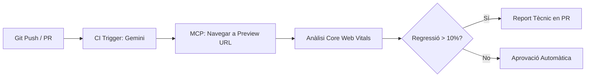
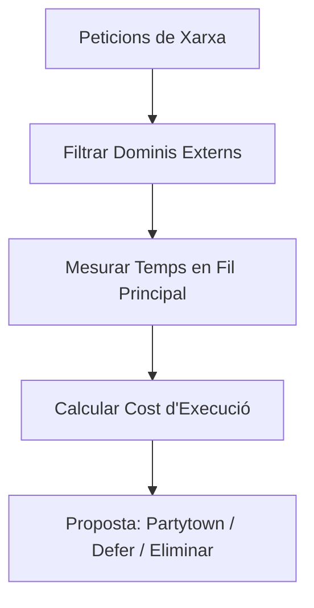

# Workflows Avançats per a Projectes Reals

Aquest document conté exemples de fluxos de treball (workflows) que pots implementar en els teus projectes del dia a dia utilitzant Gemini + Chrome DevTools MCP.

## 1. Auditoria de Performance en CI/CD (Headless)

Pots configurar Gemini perquè realitzi una auditoria automàtica en cada Pull Request abans que el codi arribi a producció.



**Prompt suggerit:**

> "Navega a la URL de preview d'aquesta PR. Executa una auditoria de Core Web Vitals en mode headless. Si el LCP augmenta més d'un 10% respecte a la rama principal, identifica quin recurs o canvi al DOM és el responsable i deixa un comentari tècnic detallat."

---

## 2. Optimització d'Imatges a Gran Escala

Ideal per a llocs d'e-commerce o blogs amb molts actius visuals.

**Prompt suggerit:**

> "Escaneja les 5 pàgines més visitades del meu lloc. Identifica totes les imatges que carreguen en el primer viewport i que no tenen l'atribut `fetchpriority='high'`. Genera un script per a afegir aquest atribut de forma automatitzada en els components corresponents."

> **Nota:** La informació sobre les pàgines més visitades podries obtenir-la automàticament si tens connectada la teva eina d'analítica (ex. Google Analytics, Search Console) mitjançant un MCP.

---

## 3. Detecció de Regressions Visuals i Layout Shift (CLS)

Usa la capacitat de Gemini per a comparar estats del DOM i traces de performance.

**Prompt suggerit:**

> "Compara el rendiment de càrrega entre `https://staging.perf.reviews` i `https://perf.reviews`. Busca específicament diferències en el Cumulative Layout Shift (CLS). Si detectes una regressió, indica'm quin element s'està movent i en quina línia de CSS es defineix la seva posició inicial."

---

## 4. Anàlisi de Tercers (Third-Party Impact)

Analitza l'impacte de scripts externs (Google Analytics, Píxels de Facebook, etc.) de forma aïllada.



**Prompt suggerit:**

> "Realitza un anàlisi de xarxa i filtra únicament els dominis de tercers. Calcula quant de temps bloquegen el fil principal en total. Proposa una estratègia de càrrega (ex. `partytown`, `defer`) per als 3 scripts més pesats o impacte en el fil principal."

> **Nota:** En molts sites, els recursos com imatges o scripts estan en un subdomini o domini diferent, la qual cosa fa que es considerin Third-Party. En tal cas, podem afegir al prompt aquests dominis com a part del projecte.

---

## Com automatitzar aquests Workflows?

Pots guardar aquests prompts com a **Custom Rules** en el teu projecte (arxiu `GEMINI.md`) perquè l'agent els tingui sempre presents com a protocols d'actuació estàndard.

**Exemple de `GEMINI.md`:**

```markdown
# Regles de Rendiment del Projecte

Sempre que analitzis una Pull Request o realitzis un canvi en el codi:

1. Utilitza el **MCP de Chrome DevTools** per a verificar el LCP a `http://localhost:3000`.
2. Si el LCP supera els 2.5s, executa automàticament la skill `webperf-core-web-vitals` per a trobar la causa.
3. Assegura't que totes les imatges "Above the fold" en un viewport de mòbil tinguin l'atribut `fetchpriority="high"`, així com la resta d'imatges (Below the fold) tinguin `loading="lazy"`.
```
