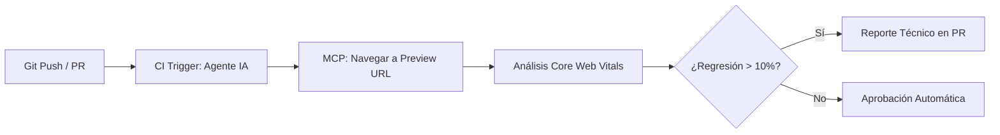
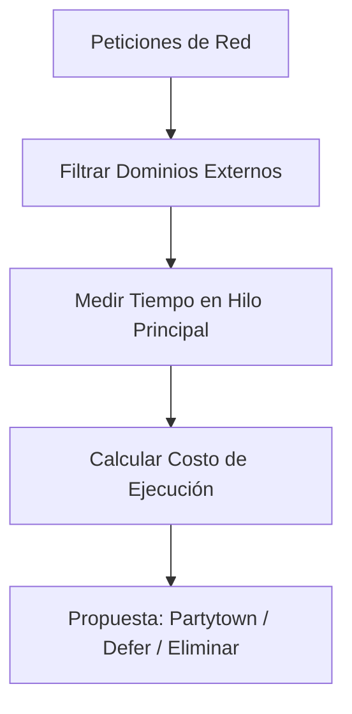

# Workflows Avanzados para Proyectos Reales

Este documento contiene ejemplos de flujos de trabajo que puedes implementar en tus proyectos del día a día utilizando cualquier agente de IA + Chrome DevTools MCP.

## 1. Auditoría de Performance en CI/CD (Headless)

Puedes configurar tu agente para que realice una auditoría automática en cada Pull Request antes de que el código llegue a producción.



**Prompt sugerido:**

> "Navega a la URL de preview de esta PR. Ejecuta una auditoría de Core Web Vitals en modo headless. Si el LCP aumenta más de un 10% respecto a la rama principal, identifica qué recurso o cambio en el DOM es el responsable y deja un comentario técnico detallado."

---

## 2. Optimización de Imágenes a Gran Escala

Ideal para sitios de e-commerce o blogs con muchos activos visuales.

**Prompt sugerido:**

> "Escanea las 5 páginas más visitadas de mi sitio. Identifica todas las imágenes que cargan en el primer viewport y que no tienen el atributo `fetchpriority='high'`. Genera un script para añadir este atributo de forma automatizada en los componentes correspondientes."

> **Nota:** La información sobre las páginas más visitadas podrías obtenerla automáticamente si tienes conectada tu herramienta de analítica (ej. Google Analytics, Search Console) mediante un MCP.

---

## 3. Detección de Regresiones Visuales y Layout Shift (CLS)

Usa la capacidad del agente para comparar estados del DOM y trazas de performance.

**Prompt sugerido:**

> "Compara el rendimiento de carga entre `https://staging.perf.reviews` y `https://perf.reviews`. Busca específicamente diferencias en el Cumulative Layout Shift (CLS). Si detectas una regresión, indícame qué elemento se está moviendo y en qué línea de CSS se define su posición inicial."

---

## 4. Análisis de Terceros (Third-Party Impact)

Analiza el impacto de scripts externos (Google Analytics, Píxeles de Facebook, etc.) de forma aislada.



**Prompt sugerido:**

> "Realiza un análisis de red y filtra únicamente los dominios de terceros. Calcula cuánto tiempo bloquean el hilo principal en total. Propón una estrategia de carga (ej. `partytown`, `defer`) para los 3 scripts más pesados o con más impacto en el hilo principal."

> **Nota:** En muchos sites, los recursos como imágenes o scripts están en un subdominio o dominio diferente, lo que hace que se consideren Third-Party. En tal caso, podemos añadir al prompt esos dominios como parte del proyecto.

---

## ¿Cómo automatizar estos Workflows?

Puedes guardar estos prompts como **Reglas** en tu proyecto para que el agente los tenga siempre presentes como protocolos de actuación estándar. Cada herramienta usa su propio formato — activa el que corresponde a tu agente (ver Ejercicio 3).

**Ejemplo de contenido del archivo de reglas:**

```markdown
# Reglas de Rendimiento del Proyecto

Siempre que analices una Pull Request o realices un cambio en el código:

1. Utiliza el **MCP de Chrome DevTools** para verificar el LCP en `http://localhost:3000`.
2. Si el LCP supera los 2.5s, ejecuta automáticamente la skill `webperf-core-web-vitals` para encontrar la causa.
3. Asegúrate de que todas las imágenes "Above the fold" en un viewport de móvil tengan el atributo `fetchpriority="high"`, y el resto (Below the fold) tengan `loading="lazy"`.
```

| Herramienta | Archivo de reglas |
|---|---|
| Gemini CLI | `GEMINI.md` (raíz del proyecto) |
| Claude Code | `CLAUDE.md` (raíz del proyecto) |
| Codex CLI | `AGENTS.md` (raíz del proyecto) |
| Cursor | `.cursor/rules/*.mdc` |
