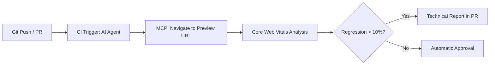
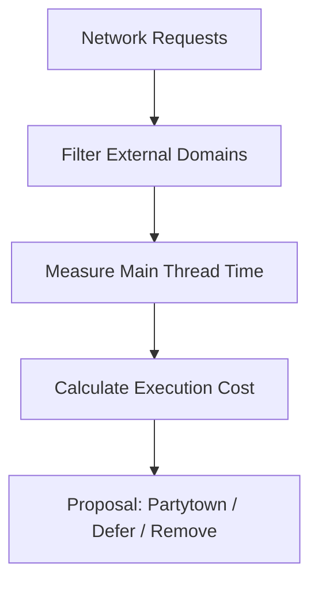

# Advanced Workflows for Real Projects

This document contains examples of workflows you can implement in your daily projects using any AI agent + Chrome DevTools MCP.

## 1. Performance Audit in CI/CD (Headless)

You can configure your agent to perform an automatic audit on every Pull Request before the code reaches production.



**Suggested Prompt:**

> "Navigate to the preview URL of this PR. Run a Core Web Vitals audit in headless mode. If the LCP increases by more than 10% compared to the main branch, identify which resource or DOM change is responsible and leave a detailed technical comment."

---

## 2. Large-Scale Image Optimization

Ideal for e-commerce sites or blogs with many visual assets.

**Suggested Prompt:**

> "Scan the 5 most visited pages of my site. Identify all images that load in the first viewport and don't have the `fetchpriority='high'` attribute. Generate a script to add this attribute automatically in the corresponding components."

> **Note:** Information about the most visited pages could be obtained automatically if you have your analytics tool (e.g., Google Analytics, Search Console) connected via an MCP.

---

## 3. Detection of Visual Regressions and Layout Shift (CLS)

Use the agent's ability to compare DOM states and performance traces.

**Suggested Prompt:**

> "Compare the loading performance between `https://staging.perf.reviews` and `https://perf.reviews`. Specifically look for differences in Cumulative Layout Shift (CLS). If you detect a regression, tell me which element is moving and in which line of CSS its initial position is defined."

---

## 4. Third-Party Impact Analysis

Analyze the impact of external scripts (Google Analytics, Facebook Pixels, etc.) in isolation.



**Suggested Prompt:**

> "Perform a network analysis and filter only third-party domains. Calculate how much total time they block the main thread. Propose a loading strategy (e.g., `defer`) for the top 3 heaviest scripts or those with the most impact on the main thread."

> **Note:** On many sites, resources like images or scripts are on a subdomain or different domain, which makes them considered Third-Party. In such cases, we can add those domains to the prompt as part of the project.

---

## How to Automate These Workflows?

You can save these prompts as **Rules** in your project so the agent always keeps them in mind as standard operating protocols. Each tool uses its own file format — activate the one that corresponds to your agent (see Exercise 3).

**Example of rules file content:**

```markdown
# Project Performance Rules

Whenever you analyze a Pull Request or make a code change:

1. Use the **Chrome DevTools MCP** to verify LCP at `http://localhost:3000`.
2. If LCP exceeds 2.5s, automatically run the `webperf-core-web-vitals` skill to find the cause.
3. Ensure all "Above the fold" images in a mobile viewport have the `fetchpriority="high"` attribute, and all other images (Below the fold) have `loading="lazy"`.
```

| Tool        | Rules file                 |
| ----------- | -------------------------- |
| Gemini CLI  | `GEMINI.md` (project root) |
| Claude Code | `CLAUDE.md` (project root) |
| Codex CLI   | `AGENTS.md` (project root) |
| Cursor      | `.cursor/rules/*.mdc`      |
