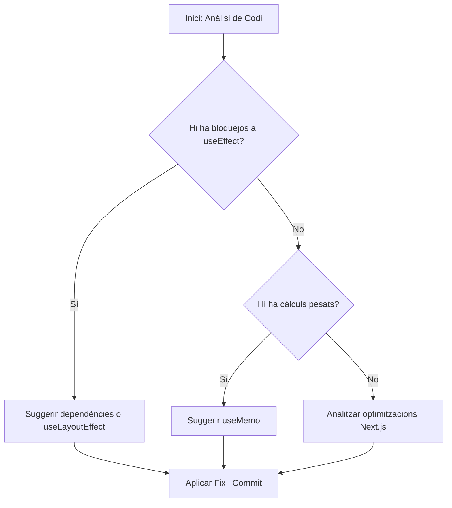

# Exercici 5: Anàlisi Profunda i SKILLs Externes (Vercel & Next.js)

En aquest pas final, utilitzarem una aplicació de **Next.js** plena d'anti-patrons de rendiment per a veure com l'agent, recolzat per habilitats especialitzades de Vercel i context estès, pot netejar i optimitzar el nostre codi.

## Pas 1: Aixecar l'aplicació de Next.js

1. Entra al directori de la demo i instal·la les dependències:
   ```bash
   cd demos/nextjs-performance-app
   npm install
   ```
2. Executa el servidor de desenvolupament:
   ```bash
   npm run dev
   ```
   _Obre http://localhost:3000_

---

## ⚡ Pas 2: Estendre les Regles per a React & Next.js

Aquest pas introdueix un concepte clau: l'**scope del context**.
Un agent genèric i un expert en React produeixen diagnòstics molt diferents davant del mateix problema.
Estàs a punt de convertir el teu agent en un expert en rendiment React i Next.js.

Tria el mètode per a la teva eina:

### Gemini CLI
Afegeix les regles de React/Next.js al teu `GEMINI.md` actiu:
```bash
cat exercises/05-deep-analysis/_rules-react-nextjs.md >> GEMINI.md
```

### Claude Code
Al teu `CLAUDE.md`, descomenta la línia de `@import`:
```diff
- <!-- @exercises/05-deep-analysis/_rules-react-nextjs.md -->
+ @exercises/05-deep-analysis/_rules-react-nextjs.md
```
El prefix `@` indica a Claude Code que carregui el contingut d'aquell arxiu directament al context — sense copiar i enganxar. Així és com es composa el context de l'agent des de múltiples fonts.

### Codex CLI
Afegeix les regles de React/Next.js al teu `AGENTS.md` actiu:
```bash
cat exercises/05-deep-analysis/_rules-react-nextjs.md >> AGENTS.md
```

### Cursor
Ves a **Cursor Settings → Rules** i activa `_webperf-ex05`.
La regla té scope a `demos/nextjs-performance-app/**` — s'aplica automàticament quan aquests arxius estan al context.

---

## Pas 3: Instal·lació de SKILLs de Vercel

Instal·larem les habilitats oficials de Vercel per a millors pràctiques en React i Next.js:

```bash
npx skills add https://github.com/vercel-labs/agent-skills --skill vercel-react-best-practices
```

_Nota: Aquestes habilitats contenen regles específiques per a detectar usos incorrectes de `useEffect`, `useMemo`, i optimitzacions de Next.js._

### Com funciona l'anàlisi autònoma?



## Pas 4: Anàlisi Estàtica i Suggeriment de Fixes

Demana a l'agent el següent des de l'arrel del projecte:

> "Analitza l'arxiu `demos/nextjs-performance-app/src/app/page.tsx`. Utilitza les teves habilitats de `vercel-react-best-practices` per a identificar tots els problemes de rendiment. Explica'm per què són anti-patrons i proposa una versió optimitzada de l'arxiu."

### Què buscarà l'agent?

- **useEffect sense dependències**: Detectarà que s'executa en cada render, bloquejant el fil principal innecessàriament.
- **Càlculs pesats al cos**: Suggerirà l'ús de `useMemo` per a evitar re-càlculs constants.
- **Optimització de renderitzat**: Identificarà com les actualitzacions d'estat estan afectant la interactivitat (INP).

## Pas 5: Aplicar el Fix i Verificar amb MCP

Una vegada l'agent et doni la solució:

1. Dona una **Directiva** explícita per aplicar els canvis (p.ex., "Endavant", "Aplica-ho").
2. Torna al navegador (amb el MCP actiu) i realitza una nova traça de performance per a verificar que els bloquejos han desaparegut i la interactivitat és fluïda.

---

Enhorabona! Has completat el workshop recorrent tot l'espectre: des de l'anàlisi manual al navegador fins a l'optimització automàtica basada en el coneixement expert de SKILLs de tercers.
