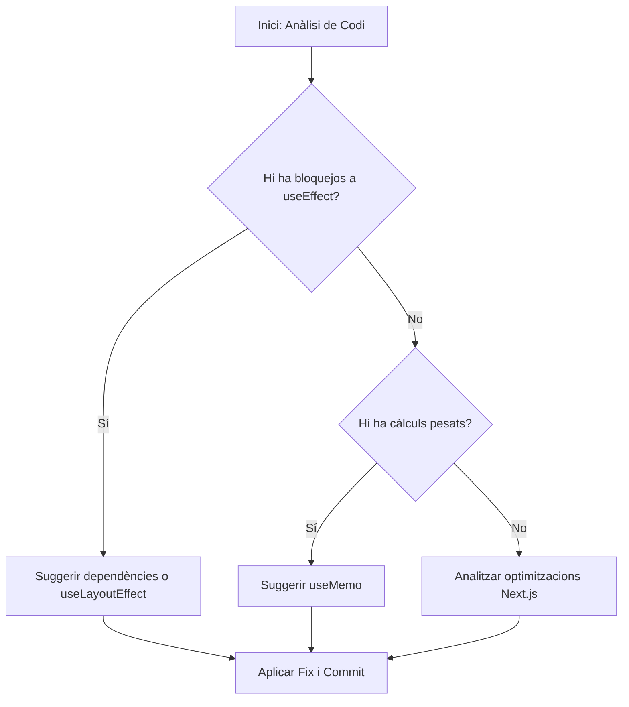

# Exercici 5: Anàlisi Profunda i SKILLs Externes (Vercel & Next.js)

En aquest pas final, utilitzarem una aplicació de **Next.js** plena d'anti-patrons de rendiment per a veure com Gemini, recolzat per habilitats especialitzades de Vercel, pot netejar i optimitzar el nostre codi.

## Pas 1: Aixecar l'aplicació de Next.js

1. Entra al directori de la demo i instal·la les dependències:
   ```bash
   cd demos/nextjs-performance-app
   npm install
   ```
2. Executa el servidor de desenvolupament:
   ```bash
   npm run dev
   ```
   _Obre http://localhost:3000_

## Pas 2: Instal·lació de SKILLs de Vercel

Instal·larem les habilitats oficials de Vercel per a millors pràctiques en React i Next.js:

```bash
npx skills add https://github.com/vercel-labs/agent-skills --skill vercel-react-best-practices
```

_Nota: Aquestes habilitats contenen regles específiques per a detectar usos incorrectes de `useEffect`, `useMemo`, i optimitzacions de Next.js._

### Com funciona l'anàlisi autònoma?



## Pas 3: Anàlisi Estàtica i Suggeriment de Fixes

Demana a Gemini el següent des de l'arrel del projecte:

> "Analitza l'arxiu `demos/nextjs-performance-app/src/app/page.tsx`. Utilitza les teves habilitats de `vercel-react-best-practices` per a identificar tots els problemes de rendiment. Explica'm per què són anti-patrons i proposa una versió optimitzada de l'arxiu."

### Què buscarà Gemini?

- **useEffect sense dependències**: Detectarà que s'executa en cada render, bloquejant el fil principal innecessàriament.
- **Càlculs pesats al cos**: Suggerirà l'ús de `useMemo` per a evitar re-càlculs constants.
- **Optimització de renderitzat**: Identificarà com les actualitzacions d'estat estan afectant la interactivitat (INP).

## Pas 4: Aplicar el Fix i Verificar amb MCP

Una vegada Gemini et doni la solució:

1. Demana-li que **apliqui els canvis** a l'arxiu.
2. Torna al navegador (amb el MCP actiu) i realitza una nova traça de performance per a verificar que els bloquejos han desaparegut i la interactivitat és fluïda.

---

Enhorabona! Has completat el workshop recorrent tot l'espectre: des de l'anàlisi manual al navegador fins a l'optimització automàtica basada en el coneixement expert de SKILLs de tercers.
