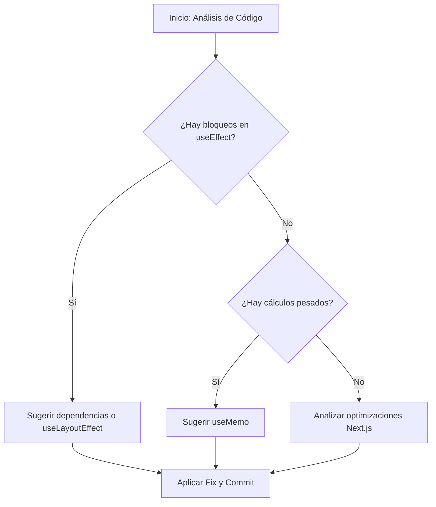

# Ejercicio 5: Análisis Profundo y SKILLs Externas (Vercel & Next.js)

En este paso final, utilizaremos una aplicación de **Next.js** llena de anti-patrones de rendimiento para ver cómo el agente, apoyado por SKILLs especializadas de Vercel y contexto extendido, puede limpiar y optimizar nuestro código.

## Paso 1: Levantar la aplicación de Next.js

1. Entra en el directorio de la demo e instala las dependencias:
   ```bash
   cd demos/nextjs-performance-app
   npm install
   ```
2. Ejecuta el servidor de desarrollo:
   ```bash
   npm run dev
   ```
   _Abre http://localhost:3000_

---

## ⚡ Paso 2: Extender las Reglas para React & Next.js

Este paso introduce un concepto clave: el **scope del contexto**.
Un agente genérico y un experto en React producen diagnósticos muy diferentes ante el mismo problema.
Estás a punto de convertir tu agente en un experto en rendimiento React y Next.js.

Elige el método para tu herramienta:

### Gemini CLI

Añade las reglas de React/Next.js a tu `GEMINI.md` activo:

```bash
cat exercises/05-deep-analysis/_rules-react-nextjs.md >> GEMINI.md
```

### Claude Code

En tu `CLAUDE.md`, descomenta la línea de `@import`:

```diff
- <!-- @exercises/05-deep-analysis/_rules-react-nextjs.md -->
+ @exercises/05-deep-analysis/_rules-react-nextjs.md
```

El prefijo `@` indica a Claude Code que cargue el contenido de ese archivo directamente en el contexto — sin copiar y pegar. Así es como se compone el contexto del agente desde múltiples fuentes.

### Codex CLI

Añade las reglas de React/Next.js a tu `AGENTS.md` activo:

```bash
cat exercises/05-deep-analysis/_rules-react-nextjs.md >> AGENTS.md
```

### Cursor

Ve a **Cursor Settings → Rules** y activa `_webperf-ex05`.
La regla está con scope a `demos/nextjs-performance-app/**` — se aplica automáticamente cuando esos archivos están en contexto.

---

## Paso 3: Instalación de SKILLs de Vercel

Instalaremos las SKILLs oficiales de Vercel para mejores prácticas en React y Next.js:

```bash
npx skills add https://github.com/vercel-labs/agent-skills --skill vercel-react-best-practices
```

_Nota: Estas SKILLs contienen reglas específicas para detectar usos incorrectos de `useEffect`, `useMemo`, y optimizaciones de Next.js._

### ¿Cómo funciona el análisis autónomo?



## Paso 4: Análisis Estático y Sugerencia de Fixes

Pide al agente lo siguiente desde la raíz del proyecto:

> "Analiza el archivo `demos/nextjs-performance-app/src/app/page.tsx`. Utiliza tus SKILLs de `vercel-react-best-practices` para identificar todos los problemas de rendimiento. Explícame por qué son anti-patrones y propón una versión optimizada del archivo."

### ¿Qué buscará el agente?

- **useEffect sin dependencias**: Detectará que se ejecuta en cada render, bloqueando el hilo principal innecesariamente.
- **Cálculos pesados en el cuerpo**: Sugerirá el uso de `useMemo` para evitar re-cálculos constantes.
- **Optimización de renderizado**: Identificará cómo las actualizaciones de estado están afectando a la interactividad (INP).

## Paso 5: Aplicar el Fix y Verificar con MCP

Una vez el agente te dé la solución:

1. Da una **Directiva** explícita para aplicar los cambios (p.ej., "Adelante", "Aplícalo").
2. Vuelve al navegador (con el MCP activo) y realiza una nueva traza de performance para verificar que los bloqueos han desaparecido y la interactividad es fluida.

---

## Bonus: Guardarraíles Genéricos de Rendimiento para el Desarrollo Asistido por IA

> Cada vez que un agente genera una nueva feature, puede introducir una regresión de rendimiento. Las reglas específicas de framework (React, Next.js) ayudan a corregir anti-patrones conocidos. Los guardarraíles genéricos evitan que se introduzcan regresiones desde el principio.

Cuando desarrollas con agentes, el agente no tiene ningún incentivo inherente para preservar el rendimiento. Sin restricciones explícitas en su contexto, cada nueva feature es una regresión potencial. La solución es codificar las reglas de rendimiento directamente en el contexto del agente — no solo para sesiones de análisis, sino de forma permanente.

Las [`agent-skills` de Addy Osmani](https://github.com/addyosmani/agent-skills) son una colección de SKILLs de ingeniería de nivel producción para agentes de IA. Su skill [`performance-optimization`](https://github.com/addyosmani/agent-skills/tree/main/skills/performance-optimization) enseña al agente a:

- **Medir antes de optimizar** — perfilar primero, nunca adivinar
- **Respetar los umbrales de Core Web Vitals** — LCP ≤ 2.5s, INP ≤ 200ms, CLS ≤ 0.1
- **Detectar anti-patrones comunes** — consultas N+1, imágenes sin dimensiones, crecimiento descontrolado del bundle, caché ausente

### Instalación

**Claude Code**:

```
/plugin marketplace add addyosmani/agent-skills
/plugin install agent-skills@addy-agent-skills
```

**Gemini CLI**:

```bash
gemini skills install https://github.com/addyosmani/agent-skills.git --path skills
```

**Cursor**: Copia `skills/performance-optimization/SKILL.md` en `.cursor/rules/`

**Codex / otros agentes**: Las skills son Markdown plano — añade el contenido a `AGENTS.md`:

```bash
curl -s https://raw.githubusercontent.com/addyosmani/agent-skills/main/skills/performance-optimization/SKILL.md >> AGENTS.md
```

### Dos capas, un mismo objetivo

| Capa                                       | Qué hace                                                      |
| ------------------------------------------ | ------------------------------------------------------------- |
| **Skills de framework** (Vercel, React)    | Corrige anti-patrones conocidos en el código existente        |
| **Guardarraíles genéricos** (agent-skills) | Previene nuevas regresiones antes de que lleguen a producción |

Ambas capas juntas son lo que mantiene el rendimiento sostenible a medida que crece un codebase asistido por IA.

> **¿Y si el agente ignora los guardarraíles?** Con el contexto sobrecargado o en sesiones largas, el agente puede derivar y generar código que no respeta las reglas — aunque las skills estén cargadas. La solución natural es un agente auditor independiente que revise el resultado con independencia de cómo se haya comportado el agente generador. El [RFC `web-performance-auditor`](https://github.com/addyosmani/agent-skills/issues/85) propone exactamente esto para `agent-skills`. Si el problema te interesa, es una buena issue donde contribuir.

---

¡Enhorabuena! Has completado el workshop recorriendo todo el espectro: desde el análisis manual en el navegador hasta la optimización automática basada en el conocimiento experto de SKILLs de terceros.
