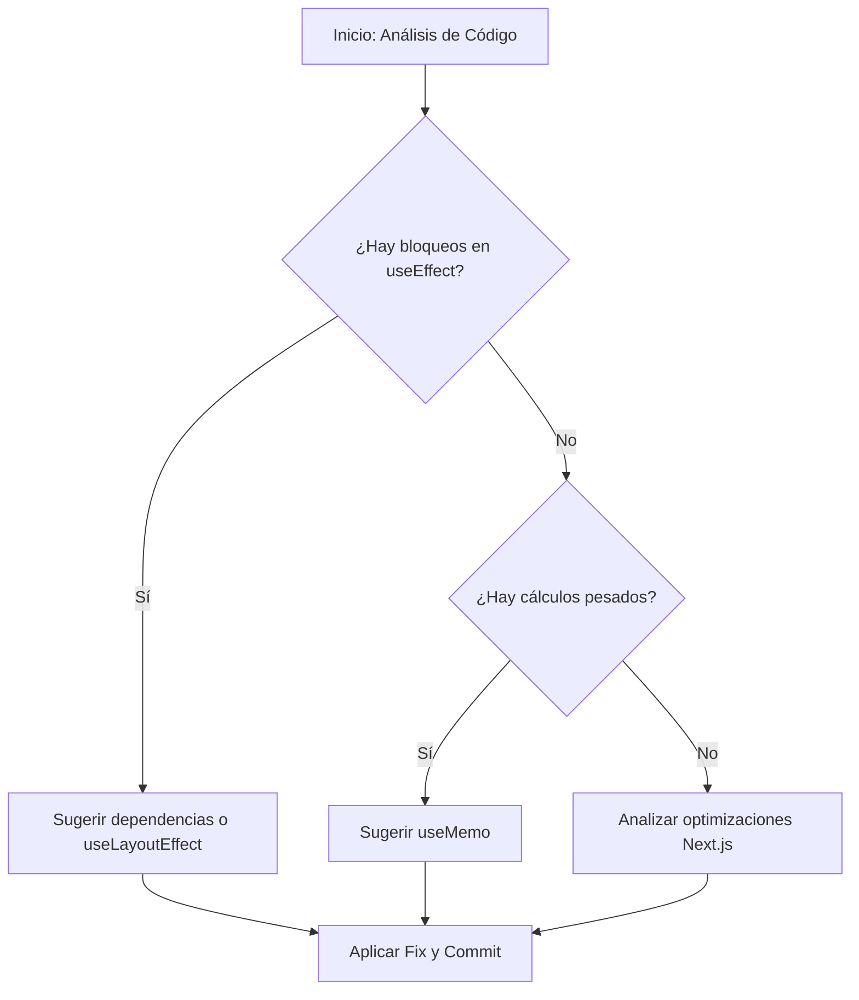

# Ejercicio 5: Análisis Profundo y SKILLs Externas (Vercel & Next.js)

En este paso final, utilizaremos una aplicación de **Next.js** llena de anti-patrones de rendimiento para ver cómo Gemini, apoyado por habilidades especializadas de Vercel, puede limpiar y optimizar nuestro código.

## Paso 1: Levantar la aplicación de Next.js

1. Entra en el directorio de la demo e instala las dependencias:
   ```bash
   cd demos/nextjs-performance-app
   npm install
   ```
2. Ejecuta el servidor de desarrollo:
   ```bash
   npm run dev
   ```
   _Abre http://localhost:3000_

## Paso 2: Instalación de SKILLs de Vercel

Instalaremos las habilidades oficiales de Vercel para mejores prácticas en React y Next.js:

```bash
npx skills add https://github.com/vercel-labs/agent-skills --skill vercel-react-best-practices
```

_Nota: Estas habilidades contienen reglas específicas para detectar usos incorrectos de `useEffect`, `useMemo`, y optimizaciones de Next.js._

### ¿Cómo funciona el análisis autónomo?



## Paso 3: Análisis Estático y Sugerencia de Fixes

Pide a Gemini lo siguiente desde la raíz del proyecto:

> "Analiza el archivo `demos/nextjs-performance-app/src/app/page.tsx`. Utiliza tus habilidades de `vercel-react-best-practices` para identificar todos los problemas de rendimiento. Explícame por qué son anti-patrones y propón una versión optimizada del archivo."

### ¿Qué buscará Gemini?

- **useEffect sin dependencias**: Detectará que se ejecuta en cada render, bloqueando el hilo principal innecesariamente.
- **Cálculos pesados en el cuerpo**: Sugerirá el uso de `useMemo` para evitar re-cálculos constantes.
- **Optimización de renderizado**: Identificará cómo las actualizaciones de estado están afectando a la interactividad (INP).

## Paso 4: Aplicar el Fix y Verificar con MCP

Una vez Gemini te dé la solución:

1. Pídele que **aplica los cambios** al archivo.
2. Vuelve al navegador (con el MCP activo) y realiza una nueva traza de performance para verificar que los bloqueos han desaparecido y la interactividad es fluida.

---

¡Enhorabuena! Has completado el workshop recorriendo todo el espectro: desde el análisis manual en el navegador hasta la optimización automática basada en el conocimiento experto de SKILLs de terceros.
