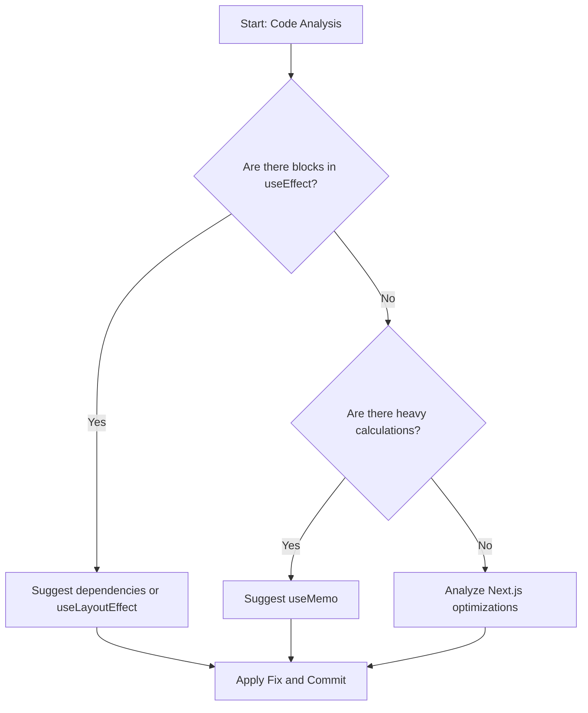

# Exercise 5: Deep Analysis and External SKILLs (Vercel & Next.js)

In this final step, we will use a **Next.js** application full of performance anti-patterns to see how Gemini, supported by specialized Vercel skills, can clean up and optimize our code.

## Step 1: Run the Next.js application

1. Enter the demo directory and install dependencies:
   ```bash
   cd demos/nextjs-performance-app
   npm install
   ```
2. Run the development server:
   ```bash
   npm run dev
   ```
   _Open http://localhost:3000_

## Step 2: Vercel SKILLs Installation

We will install the official Vercel skills for React and Next.js best practices:

```bash
npx skills add https://github.com/vercel-labs/agent-skills --skill vercel-react-best-practices
```

_Note: These skills contain specific rules for detecting incorrect uses of `useEffect`, `useMemo`, and Next.js optimizations._

### How does autonomous analysis work?



## Step 3: Static Analysis and Suggestion of Fixes

Ask Gemini the following from the project root:

> "Analyze the file `demos/nextjs-performance-app/src/app/page.tsx`. Use your `vercel-react-best-practices` skills to identify all performance issues. Explain why they are anti-patterns and propose an optimized version of the file."

### What will Gemini look for?

- **useEffect without dependencies**: It will detect that it runs on every render, unnecessarily blocking the main thread.
- **Heavy calculations in the body**: It will suggest using `useMemo` to avoid constant recalculations.
- **Rendering optimization**: It will identify how state updates are affecting interactivity (INP).

## Step 4: Apply the Fix and Verify with MCP

Once Gemini gives you the solution:

1. Ask it to **apply the changes** to the file.
2. Go back to the browser (with MCP active) and perform a new performance trace to verify that the blocks have disappeared and interactivity is fluid.

---

Congratulations! You have completed the workshop, covering the entire spectrum: from manual analysis in the browser to automatic optimization based on the expert knowledge of third-party SKILLs.
