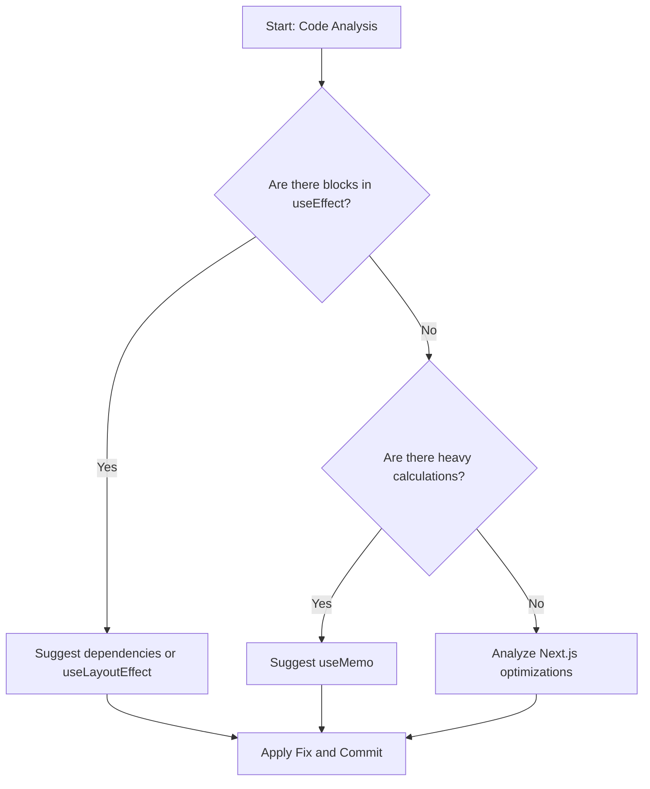

# Exercise 5: Deep Analysis and External SKILLs (Vercel & Next.js)

In this final step, we will use a **Next.js** application full of performance anti-patterns to see how the agent, supported by specialized Vercel skills and extended context, can clean up and optimize our code.

## Step 1: Run the Next.js application

1. Enter the demo directory and install dependencies:
   ```bash
   cd demos/nextjs-performance-app
   npm install
   ```
2. Run the development server:
   ```bash
   npm run dev
   ```
   _Open http://localhost:3000_

---

## ⚡ Step 2: Extend the Rules for React & Next.js

This step introduces a core concept: **context scope**.
A generic agent and a React expert produce very different diagnoses for the same problem.
You are about to make your agent an expert in React and Next.js performance.

Choose the method for your tool:

### Gemini CLI

Append the React/Next.js rules to your active `GEMINI.md`:

```bash
cat exercises/05-deep-analysis/_rules-react-nextjs.md >> GEMINI.md
```

### Claude Code

In your `CLAUDE.md`, uncomment the `@import` line:

```diff
- <!-- @exercises/05-deep-analysis/_rules-react-nextjs.md -->
+ @exercises/05-deep-analysis/_rules-react-nextjs.md
```

The `@` prefix tells Claude Code to load that file's content directly into context — no copy-paste needed. This is how you compose agent context from multiple sources.

### Codex CLI

Append the React/Next.js rules to your active `AGENTS.md`:

```bash
cat exercises/05-deep-analysis/_rules-react-nextjs.md >> AGENTS.md
```

### Cursor

Go to **Cursor Settings → Rules** and enable `_webperf-ex05`.
The rule is scoped to `demos/nextjs-performance-app/**` — it applies automatically when those files are in context.

---

## Step 3: Vercel SKILLs Installation

We will install the official Vercel skills for React and Next.js best practices:

```bash
npx skills add https://github.com/vercel-labs/agent-skills --skill vercel-react-best-practices
```

_Note: These skills contain specific rules for detecting incorrect uses of `useEffect`, `useMemo`, and Next.js optimizations._

### How does autonomous analysis work?



## Step 4: Static Analysis and Suggestion of Fixes

Ask your agent the following from the project root:

> "Analyze the file `demos/nextjs-performance-app/src/app/page.tsx`. Use your `vercel-react-best-practices` skills to identify all performance issues. Explain why they are anti-patterns and propose an optimized version of the file."

### What will the agent look for?

- **useEffect without dependencies**: It will detect that it runs on every render, unnecessarily blocking the main thread.
- **Heavy calculations in the body**: It will suggest using `useMemo` to avoid constant recalculations.
- **Rendering optimization**: It will identify how state updates are affecting interactivity (INP).

## Step 5: Apply the Fix and Verify with MCP

Once the agent gives you the solution:

1. Give an explicit **Directive** to apply the changes (e.g., "Go ahead", "Apply it").
2. Go back to the browser (with MCP active) and perform a new performance trace to verify that the blocks have disappeared and interactivity is fluid.

---

## Bonus: Generic Performance Guardrails for AI-Assisted Development

> Every time an agent generates a new feature, it can introduce a performance regression. Framework-specific rules (React, Next.js) help fix known anti-patterns. Generic guardrails prevent regressions from being introduced in the first place.

When you develop with agents, the agent has no inherent incentive to preserve performance. Without explicit constraints in its context, each new feature is a potential regression. The solution is to encode performance rules directly into the agent's context — not just for analysis sessions, but permanently.

[Addy Osmani's `agent-skills`](https://github.com/addyosmani/agent-skills) is a collection of production-grade engineering skills for AI agents. Its [`performance-optimization`](https://github.com/addyosmani/agent-skills/tree/main/skills/performance-optimization) skill teaches the agent to:

- **Measure before optimizing** — profile first, never guess
- **Respect Core Web Vitals thresholds** — LCP ≤ 2.5s, INP ≤ 200ms, CLS ≤ 0.1
- **Detect common anti-patterns** — N+1 queries, images without dimensions, unbounded bundle growth, missing caching

### Install

**Claude Code**:

```
/plugin marketplace add addyosmani/agent-skills
/plugin install agent-skills@addy-agent-skills
```

**Gemini CLI**:

```bash
gemini skills install https://github.com/addyosmani/agent-skills.git --path skills
```

**Cursor**: Copy `skills/performance-optimization/SKILL.md` into `.cursor/rules/`

**Codex / other agents**: Skills are plain Markdown — append the content to `AGENTS.md`:

```bash
curl -s https://raw.githubusercontent.com/addyosmani/agent-skills/main/skills/performance-optimization/SKILL.md >> AGENTS.md
```

### Two layers, one goal

| Layer                                 | What it does                                         |
| ------------------------------------- | ---------------------------------------------------- |
| **Framework skills** (Vercel, React)  | Fix known anti-patterns in existing code             |
| **Generic guardrails** (agent-skills) | Prevent new regressions before they reach production |

Both layers together are what keep performance sustainable as an AI-assisted codebase grows.

> **What if the agent ignores the guardrails?** With an overloaded context or in long sessions, an agent can drift and generate code that doesn't respect the rules — even with skills loaded. The natural solution is an independent auditor agent that reviews the output regardless of how the generating agent behaved. The [`web-performance-auditor` RFC](https://github.com/addyosmani/agent-skills/issues/85) proposes exactly this for `agent-skills`. If the problem interests you, it's a good issue to contribute to.

---

Congratulations! You have completed the workshop, covering the entire spectrum: from manual analysis in the browser to automatic optimization based on the expert knowledge of third-party SKILLs.
